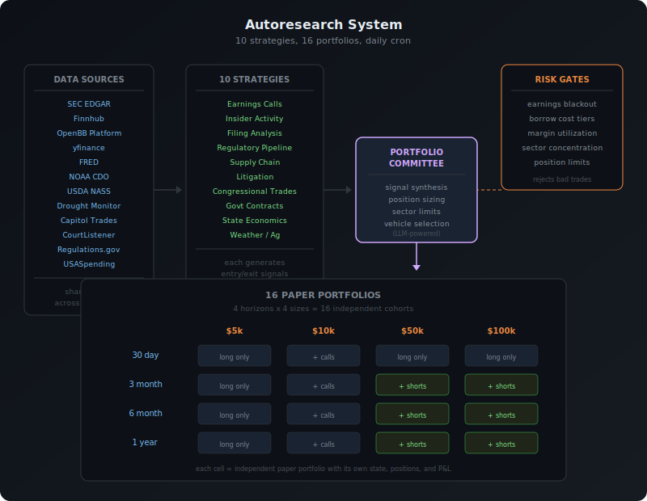
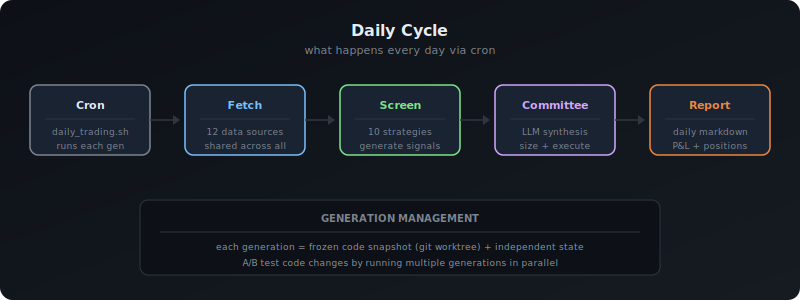

# EventEdge

An autonomous event-driven trading research system that runs 12 event-driven strategies every day across 16 paper portfolios (4 time horizons × 4 portfolio sizes), tracks what works, and learns from the results. Personal project — not a product, not a service, not financial advice.

## What it does

Each strategy looks at a specific kind of market signal — not price charts, but things like SEC filings, insider trades, and congressional trading disclosures. A portfolio committee (LLM-powered) synthesizes the signals across strategies and sizes positions per cohort.

<p align="center">
  
</p>

## The 12 strategies

Each one watches for a different kind of event and generates trade signals:

- **Earnings calls** — clustering around earnings dates and estimate revisions
- **Insider activity** — Form 4 filings (when executives buy or sell their own stock)
- **Filing analysis** — anomalies in 10-K and 10-Q filings
- **Regulatory pipeline** — FDA approvals, FCC licenses, other regulatory signals
- **Supply chain** — stress indicators across supplier/customer networks
- **Litigation** — SEC enforcement actions and major lawsuits
- **Congressional trades** — stock trades disclosed by members of Congress
- **Government contracts** — federal contract awards (USASpending data)
- **State economics** — FRED macroeconomic indicators by region
- **Weather/agriculture** — NOAA weather anomalies, USDA crop conditions, drought severity
- **Commodity macro** — CFTC COT positioning extremes, futures curves, macro regime alignment
- **Quantum readiness** — post-quantum cryptography migration signals from SEC filings and news, regime-switching across PQC vendor/crypto-exposed/quantum hardware baskets

Data comes from about a dozen sources: yfinance, Finnhub, SEC EDGAR, OpenBB, FRED, NOAA, USDA, US Drought Monitor, Capitol Trades, CourtListener, Regulations.gov, and USASpending.

## How it runs

Daily cron job on a MacBook Air (16GB M4). The generation management system lets me A/B test different code versions in parallel using git worktrees — each generation gets its own frozen copy of the code and independent state. LLM costs run about $0.03/day per generation using Claude Sonnet and Haiku.

<p align="center">
  
</p>

The 16 portfolios vary in size ($5k to $100k) and time horizon (30 days to 1 year). Bigger portfolios unlock more instruments: $10k+ can write covered calls, $50k+ can short stocks with margin and borrow cost gates.

## Setup

```bash
git clone <this repo>
cd <repo>
pip install .            # or pip install -e . for development
cp .env.example .env     # add your API keys
```

You'll need an API key for at least one LLM provider (OpenAI, Anthropic, Google, xAI, or OpenRouter). Stock prices come from yfinance by default — no key needed. Most event strategies need free-tier keys for their data sources (Finnhub, FRED, NOAA CDO, USDA NASS, FMP, EDGAR User-Agent). The system gracefully degrades if a strategy's data source is unavailable. See `.env.example` for the full list.

```bash
# Daily automation — run all active generations
python scripts/run_generations.py run-daily

# Start a new generation (A/B test a code change)
python scripts/run_generations.py start "description of what changed"

# List active generations
python scripts/run_generations.py list

# Compare generations side-by-side
python scripts/run_generations.py compare

# Streamlit dashboard (interactive, in a browser)
python -m streamlit run tradingagents/dashboard/app.py

# Email-able HTML snapshot (forward to yourself in Gmail)
python scripts/email_dashboard.py
```

Docker works too:
```bash
docker compose run --rm tradingagents
```

## Origin

This started as a fork of [TauricResearch/TradingAgents](https://github.com/TauricResearch/TradingAgents), an open-source multi-agent trading framework from [this paper](https://arxiv.org/abs/2412.20138). The original 6-agent debate pipeline was the seed; the autoresearch system, the strategies, the generation management, the portfolio committee, and the paper trading infrastructure were all built on top. The original pipeline code has since been removed since the project's focus narrowed to the autoresearch experiment.

## License

Code attributable to TauricResearch is Apache 2.0 (see `LICENSE-APACHE`). All other code is proprietary (see `LICENSE` and `NOTICE`).

Not financial advice. Not investment advice. Not trading advice.
