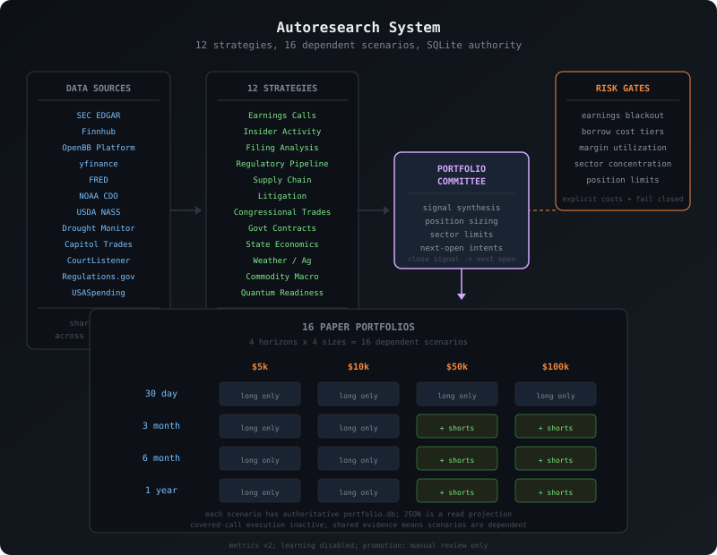
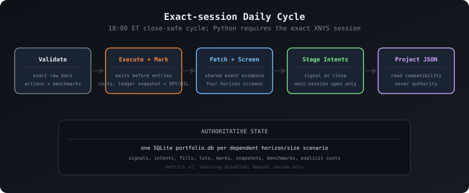

# EventEdge

An autonomous event-driven trading research system that runs 12 event-driven strategies across 16 paper portfolio scenarios (4 time horizons × 4 portfolio sizes). Personal project — not a product, not a service, not financial advice.

## What it does

Each strategy looks at a specific kind of market signal — not price charts, but things like SEC filings, insider trades, and congressional trading disclosures. A portfolio committee (LLM-powered) synthesizes the signals across strategies and sizes positions per cohort.

<p align="center">
  
</p>

## The 12 strategies

Each one watches for a different kind of event and generates trade signals:

- **Earnings calls** — clustering around earnings dates and estimate revisions
- **Insider activity** — Form 4 filings (when executives buy or sell their own stock)
- **Filing analysis** — anomalies in 10-K and 10-Q filings
- **Regulatory pipeline** — FDA approvals, FCC licenses, other regulatory signals
- **Supply chain** — stress indicators across supplier/customer networks
- **Litigation** — SEC enforcement actions and major lawsuits
- **Congressional trades** — stock trades disclosed by members of Congress
- **Government contracts** — federal contract awards (USASpending data)
- **State economics** — FRED macroeconomic indicators by region
- **Weather/agriculture** — NOAA weather anomalies, USDA crop conditions, drought severity
- **Commodity macro** — CFTC COT positioning extremes, futures curves, macro regime alignment
- **Quantum readiness** — post-quantum cryptography migration signals from SEC filings and news, regime-switching across PQC vendor/crypto-exposed/quantum hardware baskets

Data comes from about a dozen sources: yfinance, Finnhub, SEC EDGAR, OpenBB, FRED, NOAA, USDA, US Drought Monitor, Capitol Trades, CourtListener, Regulations.gov, and USASpending.

## How it runs

Production should be scheduled for 18:00 ET, after XNYS daily bars finalize; the repository does not install or change that schedule. Python checks the requested date against the XNYS calendar, so a weekday holiday is rejected rather than silently rolled to a different session. A signal observed at one session's close can only stage an intent for execution at the next exact XNYS session open.

Each cohort has its own authoritative SQLite `portfolio.db`. Signals, next-open intents, fills, lots, marks, benchmark observations, and account snapshots are recorded there with explicit slippage, commission, other fees, borrow costs, and financing. The familiar JSON files are deterministic read-compatible projections from SQLite; they are not accounting authority.

Paper-trading safety comes before a performance result. Governed execution, mark, and benchmark prices remain fail-closed. If a yfinance daily bar has internally inconsistent OHLC after the XNYS close, EventEdge can make one narrow recovery from that ticker's regular-session 60-minute bars. The interval coverage, daily open and close, and the unaffected daily extreme must agree; exactly one broken extreme can be replaced. The evidence is saved and bound to replay. Missing, ambiguous, or mismatched data still blocks the run.

Candidate-only reference bars and volatility histories use a separate path. After one bounded retry, an unresolved candidate is excluded from staging and its typed evidence is kept for replay. Identical cohort references are collapsed into one run-level issue, and the run is marked degraded. The shared incident counts once; degraded runs are ineligible as clean performance observations. Any ticker needed by an open lot or pending entry remains governed and fail-closed.

The generation management system supports parallel frozen code versions through git worktrees. EventEdge runs 16 dependent scenario portfolios. Headline performance shows four separate $100k horizon books plus an equal-weighted scenario panel; the panel is not investable fund AUM. Smaller books are concentration stress tests. Metrics use XNYS sessions, next-session-open signal outcomes, persisted SPY/BIL benchmarks, explicit costs, and immutable schema-v2 epochs. A separate, bounded policy audit counts each attributed recommendation once for accept, trim, or reject and reports signal-level ingress blocks and committee non-selection; it is governance evidence, not alpha validation. Production learning is disabled. Promotion output is advisory and requires Pedro's manual review against precommitted 30/60/90-session gates and complete benchmark, cost, and provenance evidence. Covered-call execution remains inactive until authoritative premium, assignment, expiry, and contract-mark accounting exists. Autoresearch LLM calls use Claude Sonnet 5 at medium effort, with rule-based synthesis as the failure fallback.

<p align="center">
  
</p>

The 16 portfolios vary in size ($5k to $100k) and time horizon (30 days to 1 year). Eligible $50k+ scenarios can short stocks with margin and borrow-cost gates. Covered-call settings are retained for future work, but covered-call execution is inactive.

## Setup

```bash
git clone <this repo>
cd <repo>
pip install .            # or pip install -e . for development
cp .env.example .env     # add your API keys
```

You'll need an Anthropic API key for the autoresearch LLM calls. Stock prices come from yfinance by default — no key needed. Most event strategies need free-tier keys for their data sources (Finnhub, FRED, NOAA CDO, USDA NASS, FMP, EDGAR User-Agent). The system gracefully degrades if a strategy's data source is unavailable. See `.env.example` for the full list.

```bash
# Daily automation — run all active generations
python scripts/run_generations.py run-daily --date 2026-07-31

# Optional direct checks. The scheduled daily script runs the screen first,
# then requires the governed check to be ready before it starts trading.
python scripts/run_generations.py preflight --date 2026-07-31 --preflight-mode screen
python scripts/run_generations.py preflight --date 2026-07-31 --preflight-mode governed

# Inventory legacy JSON without importing it
python scripts/migrate_ledger_state.py --legacy-state /path/to/legacy --output-dir /tmp/eventedge-ledger-check --dry-run

# Start a new generation (A/B test a code change)
python scripts/run_generations.py start "description of what changed"

# List active generations
python scripts/run_generations.py list

# Compare generations side-by-side
python scripts/run_generations.py compare \
  --pair gen_005:horizon_30d_size_100k:candidate_epoch_id,gen_004:horizon_30d_size_100k:baseline_epoch_id

# Streamlit dashboard (interactive, in a browser)
python -m streamlit run tradingagents/dashboard/app.py

# Email-able HTML snapshot (forward to yourself in Gmail)
python scripts/email_dashboard.py
```

Docker works too:
```bash
docker compose run --rm tradingagents
```

## Origin

This started as a fork of [TauricResearch/TradingAgents](https://github.com/TauricResearch/TradingAgents), an open-source multi-agent trading framework from [this paper](https://arxiv.org/abs/2412.20138). The original 6-agent debate pipeline was the seed; the autoresearch system, the strategies, the generation management, the portfolio committee, and the paper trading infrastructure were all built on top. The original pipeline code has since been removed since the project's focus narrowed to the autoresearch experiment.

## License

Code attributable to TauricResearch is Apache 2.0 (see `LICENSE-APACHE`). All other code is proprietary (see `LICENSE` and `NOTICE`).

Not financial advice. Not investment advice. Not trading advice.
