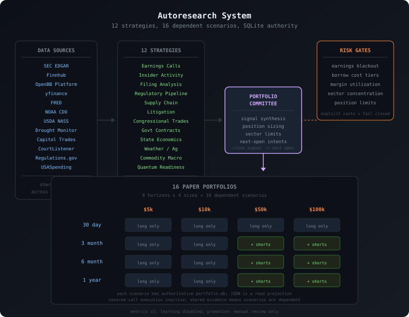
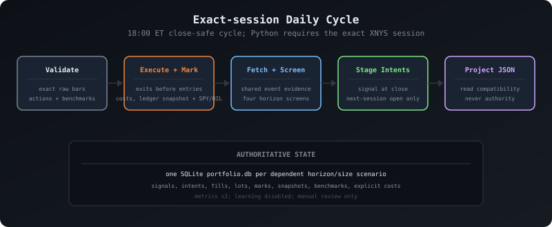

# EventEdge

An autonomous event-driven trading research system with 11 enabled strategies across 16 paper portfolio scenarios (4 time horizons × 4 portfolio sizes). A twelfth strategy identity is retained as an explicit policy exclusion. This is a personal research project.

## What it does

Strategies examine events such as SEC filings, insider trades, and congressional disclosures. An LLM portfolio committee combines their signals and sizes positions for each scenario book.

<p align="center">
  
</p>

## Strategy coverage

Enabled strategies examine these event families; actionable signals require their declared source evidence:

- Earnings calls: clustering around earnings dates and estimate revisions
- Insider activity: Form 4 filings when executives buy or sell their own stock
- Filing analysis: anomalies in 10-K and 10-Q filings
- Regulatory pipeline: FDA approvals, FCC licenses, other regulatory signals
- Supply chain: company news and peer spillover hypotheses; peer lists do not establish supplier/customer relationships
- Litigation: SEC enforcement actions and major lawsuits
- Congressional trades: stock trades disclosed by members of Congress
- Government contracts: federal contract awards from USASpending
- Weather/agriculture: NOAA weather anomalies, USDA crop conditions, drought severity
- Commodity macro: CFTC COT positioning extremes and macro regime alignment
- Quantum readiness: post-quantum cryptography migration signals from SEC filings and news, with regime-based selection among PQC vendor, crypto-exposed and quantum hardware baskets

The state-economics proxy is retired because its national indicators and sector momentum did not establish a state event. Filing occurrence and contractor momentum are also insufficient theses. Schedule 13D/G disclosures remain observations unless the subject issuer is verified. Futures term-structure inference is unsupported without maturity-identified contracts.

Event and research inputs come from Finnhub, SEC EDGAR, FMP, FRED, NOAA, USDA, US Drought Monitor, CourtListener, Regulations.gov, USASpending, CFTC and Yahoo/yfinance. OpenBB supplies optional enrichment. Congressional disclosures use the authenticated FMP stable House and Senate feeds; missing access is an explicit coverage failure. The pipeline does not scrape CapitolTrades as a fallback.

## How it runs

Production should be scheduled for 18:00 ET; the repository does not install or change that schedule. Python validates the exact requested XNYS session, including holidays and early closes. A signal observed at one session's close can stage an intent for the next exact XNYS session open.

Each cohort has its own authoritative SQLite `portfolio.db`. It records signals, next-open intents, fills, lots, marks, benchmark observations and account snapshots, with explicit slippage, commission, other fees, borrow costs and financing. JSON files are deterministic projections from SQLite.

Prior next-open exits and open-gap stops settle before opening entries; non-gap intraday stops settle afterward and cannot finance earlier entries. Admission includes costs, opening marks, marked short collateral and durable net session losses. Borrow and financing accrue over calendar days on prior accepted closing exposure. Splits precede post-split per-share distributions; missing corporate-action evidence is unavailable.

Alpaca SIP is the primary source for critical raw daily execution, mark, candidate and reference bars. The adapter requires the exact session's close plus 15 minutes, requests `feed=sip` and `adjustment=raw`, and validates the symbol, session timestamp, pagination and OHLC. Invalid or missing bars fail closed; there is no Yahoo fallback for raw prices. Yahoo remains a declared dependency for corporate actions, dividend-adjusted ETF benchmarks (SPY/BIL/VTI/VT by default), research price history, volatility and VIX.

An unresolved candidate-only reference bar or volatility history excludes that candidate from staging and persists a typed input issue. Repeated cohort references become one run-level issue. Existing-position accounting can remain valid while the run is degraded; any ticker needed by an open lot or pending entry remains governed and fail-closed.

Shared acquisition has one deadline, including provider pacing, retries and fanout queue time. Transient transport failures, timeouts, HTTP 429 and eligible 5xx responses receive bounded retries with backoff, jitter and `Retry-After`; malformed data and authentication failures are terminal. Native FRED HTTP and model SDK calls run in killable subprocesses with absolute deadlines. All horizon analysis and committee calls share a 2,400-second model budget. Each physical model transport is capped at 120 seconds; SDK retries are disabled, and explicit retries/backoff consume the shared budget. Other source clients retain cooperative deadlines; an in-flight call that cannot be interrupted may continue after the caller stops waiting. Valid partial results remain available with their failure status. Missing required inputs cannot become a healthy empty result.

Managed workers reuse successful operational source inputs from `data/source_cache`, with a maximum five-minute TTL and session/window/configuration identity checks. Failed or partial results never enter the success cache. Daily screening freezes its shared source bundle before analysis under the generation/session identity. A separate `source_inputs/staging_volatility` bundle freezes accepted volatility histories before committee decisions. An allowed resume reuses both bundles. Accepted execution inputs and source observations remain immutable. Preflight can populate the operational cache without writing accepted generation inputs.

Generations freeze code through git worktrees. Model, reasoning, strategy or other behavior changes require a fresh generation; historical evidence is preserved. The default OpenAI Responses routing uses `gpt-6-luna` with high reasoning for structured insider-buy, commodity-macro and agricultural-weather assessments, and `gpt-6-astra` with high reasoning for unstructured theses and portfolio synthesis. Incomplete or refused responses follow the failure path. Exactly identical candidate requests can reuse a fully validated response within one frozen-source run; each receiving candidate is independently validated, and horizon-specific requests and committee decisions remain separate.

The 16 scenario books share signals and source observations. The primary forward test is the $100k, three-month-horizon book; other books are dependent sensitivity scenarios. The equal-weighted scenario panel is not investable fund AUM. Metrics use XNYS sessions, split/distribution-aware next-open signal outcomes, explicit execution costs and immutable schema-v2 epochs. ETF returns chain adjacent adjusted prices from one acquisition vintage; historical unpaired observations retain their labels and cannot establish comparable benchmark metrics. SPY is the fixed primary benchmark, VTI and VT are descriptive secondary comparisons, and BIL/exposure diagnostics remain. Policy audits count attributed accept, trim and reject decisions, ingress blocks and committee non-selection. These counts are governance evidence, not alpha validation. Production learning is disabled.

Committee abstention is an explicit outcome. A valid empty recommendation list creates no orders; unavailable or invalid model responses hold cash and report degraded status. The full accepted thesis, every marked holding and deterministic admission exclusions remain inspectable. Decisions are frozen before staging for consistent crash recovery.

After an accounting gap, held inventory must reconcile every missing session's corporate actions before execution resumes. Standing protective stops survive the gap. Dividend entitlements contribute to equity but remain unavailable as cash until a verified payment date. Untraded signal outcomes have separate immutable evidence: an outcome-only data gap affects that diagnostic obligation while healthy portfolio accounting continues. Reports retain prior-epoch obligations and separate provisional, validated, selected and executed signal populations.

The [forward-test protocol](docs/research/2026-10-09-forward-test-protocol.md) fixes 30/60/90-session diagnostic readouts and a minimum of 252 valid out-of-sample returns before a strong alpha assessment. Its research hurdle is 5 percentage points of annualized net excess over SPY, positive exposure-matched excess, Sharpe at least 1 and maximum drawdown no worse than 15%. Passing a short window never triggers automatic promotion.

<p align="center">
  
</p>

The 16 portfolios vary in size ($5k to $100k) and time horizon (30 days to 1 year). Eligible $50k+ scenarios can short stocks with margin and borrow-cost gates. Covered-call execution remains inactive until authoritative premium, assignment, expiry, and contract-mark accounting exists.

## Setup

```bash
git clone <this repo>
cd <repo>
pip install .            # or pip install -e . for development
cp .env.example .env     # add your API keys
```

Set `OPENAI_API_KEY`, `ALPACA_API_KEY` and `ALPACA_SECRET_KEY` in `.env`. Alpaca credentials must permit the historical SIP queries used by the price adapter. Configure each event provider's required key or token, including FMP access to both congressional feeds and an identifying EDGAR User-Agent. See `.env.example` for the full list. Missing required access appears in source coverage and can block governed pricing or degrade strategy inputs.

Daily and preflight worker attempts retain separate JSON evidence under
`data/logs/run_attempts/`. The generation CLI prints the artifact path, and failed
governed checks also print their available ticker/reason details. Each artifact
contains the session, generation commit, process status, captured output, and
structured result; later runs do not overwrite it. Managed timeouts retain partial
output. The latest daily log remains available for existing readers.

Preflight leaves accepted generation inputs and ledgers unchanged. Daily outcomes
carry required-source and strategy-health failures through each affected cohort
and the generation summary. Accounting validity, source coverage, staging
completion and staging validity are separate checks. Optional enrichment can warn
without becoming a required-input failure.

The deterministic operational report verifies the exact session's manifest,
all attempt artifacts, shared metrics, frozen source bundle and all 16 SQLite
books. It counts distinct fill IDs, preserves preflight incidents even when the
daily run is clean, and writes reports for completed degraded runs. Missing or
conflicting evidence produces explicit diagnostics and withholds performance
claims. JSON is the canonical monitor input; Markdown presents the same facts.
`scripts/daily_trading.sh` generates both files under `docs/reports` in its exit
trap, including after a governed gate or daily failure. Reporting preserves an
existing failure status; an incomplete report makes an otherwise successful
script exit nonzero.

Clef runs an optional evidence check after all books finish staging. It samples
up to five distinct events with retained source evidence and asks whether that
evidence supports the candidate claim and company attribution. Its answers do
not feed trade selection, sizing, accounting or source-health checks. The default
budget is 20 seconds per session, with at most three seconds per request. Events
without usable source evidence are marked insufficient without an API call.
Coverage is explicit for earnings, filings, regulation, peer news, litigation and
government awards. Other strategy families remain unsupported. Classification
requires a retained atomic factual claim and untruncated provider-bound evidence;
model rationale alone is not a source-support result.

Set `CLOUDFLARE_ACCOUNT_ID` and `CLOUDFLARE_API_TOKEN` in the production environment
to activate hosted `@cf/cloudflare/clef`. The token needs Workers AI Read and Edit
permissions for that account ([Cloudflare setup](https://developers.cloudflare.com/workers-ai/get-started/rest-api/)).
Only compact public source fields and the candidate claim go to Cloudflare;
holdings, balances and credentials are excluded. The hosted model name is an
alias, so the recorded name does not establish an immutable weights revision.

Results and pending inputs live in each generation's
`decision_shadow/YYYY-MM-DD.json`. The operational report shows assessed events,
answer counts, sampling limits and errors separately from financial validity.
An attempted request is never repeated automatically, including after a timeout.
Missing credentials and exhausted budgets leave unattempted inputs that can be
processed later with `scripts/run_decision_shadow.py --help`, without running
trading or fetching new evidence. A resume without every horizon records
`incomplete_sampling` when no complete sample was saved. These observations are
for evaluation; support probabilities do not estimate a trade's chance of profit.

Evidence files use restrictive permissions and redact known credential environment
values (including common JSON/repr escaping) and common authentication fields.
Truncated quoted credentials and complete authorization-header lines are redacted;
this does not detect arbitrary unknown secrets. Keep files private: provider
payloads and research data can remain sensitive. Archives accumulate without automatic deletion;
include them in log storage/retention planning. A host loss or hard kill before the
manager finishes can still leave no finalized artifact or a private temporary file.
Temporary-file cleanup failures are logged without masking a completed archive.
Publication is atomic for readers; directory entries are not explicitly synced,
so power-loss durability is not guaranteed. Lock rejection, command
validation failure, and separately invoked report commands are outside this worker
attempt archive. If writing evidence fails, the CLI reports that separately without
changing the worker's outcome or rerunning economic work.

```bash
# Daily run for all active generations
python scripts/run_generations.py run-daily --date 2026-07-31

# Read-only operational report for all active generations
python scripts/generate_operational_report.py --repo-root /path/to/repo \
  --all-active --date 2026-07-31 --output-dir /path/to/repo/docs/reports

# Optional direct checks. The scheduled daily script runs the screen first,
# then requires the governed check to be ready before it starts trading.
python scripts/run_generations.py preflight --date 2026-07-31 --preflight-mode screen
python scripts/run_generations.py preflight --date 2026-07-31 --preflight-mode governed

# Start a new generation (A/B test a code change)
python scripts/run_generations.py start "description of what changed"

# List active generations
python scripts/run_generations.py list

# Compare generations side-by-side
python scripts/run_generations.py compare \
  --pair gen_005:horizon_30d_size_100k:candidate_epoch_id,gen_004:horizon_30d_size_100k:baseline_epoch_id

# Check five consecutive XNYS sessions in a generation. This reads state only.
python scripts/check_generation_readiness.py --repo /path/to/production/repo \
  --generation gen_NNN --expected-commit FULL_40_CHARACTER_SHA \
  --through 2026-09-21

# Streamlit dashboard (interactive, in a browser)
python -m streamlit run tradingagents/dashboard/app.py

# Email-able HTML snapshot (forward to yourself in Gmail)
python scripts/email_dashboard.py
```

The readiness command exits 0 only when all five sessions have one clean daily
result, valid completed accounting and the generation's frozen configured benchmark set
(SPY/BIL/VTI/VT by default) in all 16 cohorts,
completed staging in all 16 cohorts, no quarantined candidate bars or input
issues, and classified evidence for all 12 strategy identities across four horizons. Enabled
strategies must be healthy; the retired state-economics proxy must carry its
explicit policy exclusion and no signals. It
fails closed on missing or inconsistent records. This is a continuity check
for a generation. It does not establish a performance result.
Review incident-specific replay tests before launching a candidate and apply
the forward-test protocol before any strategy promotion; the 30/60/90-session
readouts are diagnostic milestones.

Run the checker while the runtime is idle: it requires the existing canonical
runtime lock and refuses a busy lock without creating or changing one. SQLite
reads use temporary copies, including committed WAL data; source fingerprints
must remain unchanged. The frozen generation worktree must match the full SHA
and have no tracked modifications. Evidence must match the generation epoch,
cohort, and exact strategy/horizon policies. If runtime configuration overrides
`autoresearch.paper_ledger.policy_id`, pass that same value with `--policy-id`.

The supported command-line entrypoint is `python scripts/run_generations.py`;
`python main.py` forwards to the same CLI. Deployment units are in `deploy/`.
There is no repository-managed Docker Compose stack.

Default trading dates use New York calendar time. Weekend/holiday dates are not
silently replayed; use an explicit `--date YYYY-MM-DD` for an intended catch-up,
subject to the same exact-session and historical-input validity checks.

## Origin

This started as a fork of [TauricResearch/TradingAgents](https://github.com/TauricResearch/TradingAgents), an open-source multi-agent trading framework from [this paper](https://arxiv.org/abs/2412.20138). The original 6-agent debate pipeline was the seed; the autoresearch system, the strategies, the generation management, the portfolio committee, and the paper trading infrastructure were all built on top. The original pipeline code has since been removed since the project's focus narrowed to the autoresearch experiment.

## License

Code attributable to TauricResearch is Apache 2.0 (see `LICENSE-APACHE`). All other code is proprietary (see `LICENSE` and `NOTICE`).

Not financial advice. Not investment advice. Not trading advice.
